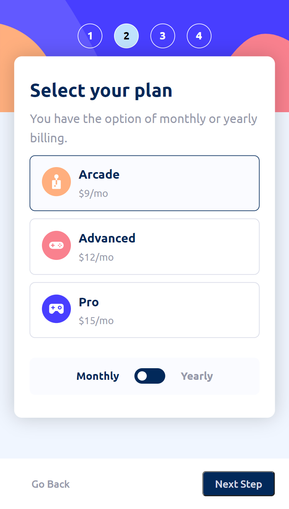
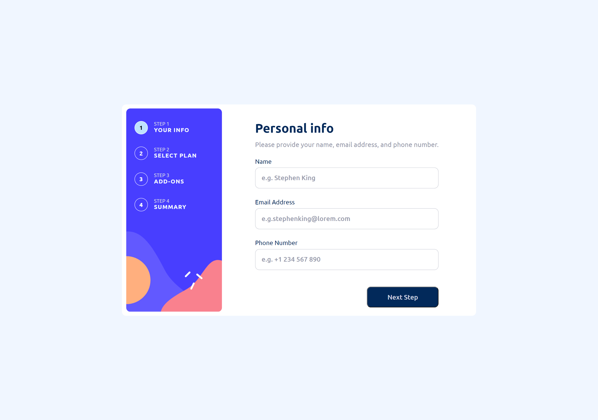
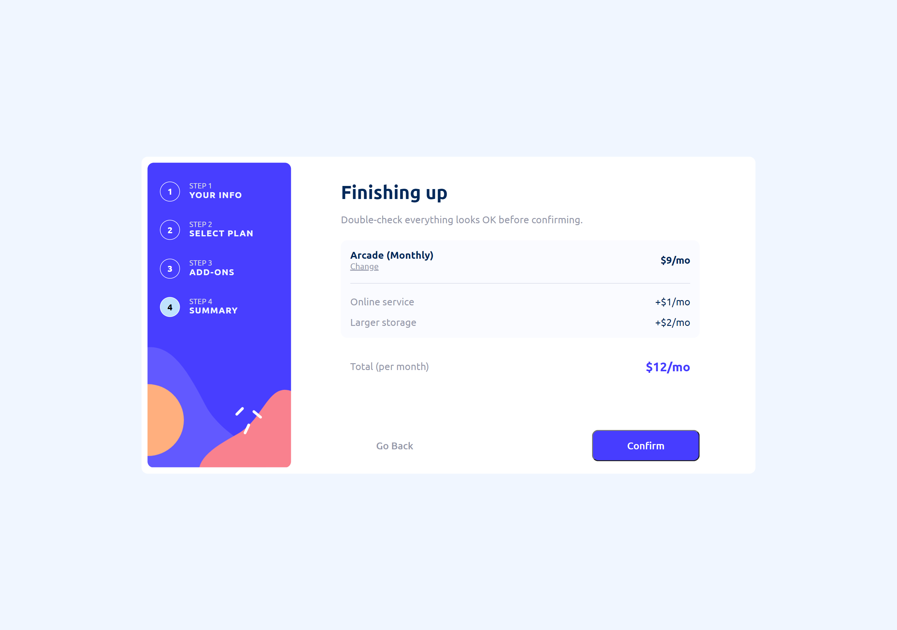

# Frontend Mentor - Multi-step form solution

This is a solution to the [Multi-step form challenge on Frontend Mentor](https://www.frontendmentor.io/challenges/multistep-form-YVAnSdqQBJ). Frontend Mentor challenges help you improve your coding skills by building realistic projects.

## Table of contents

- [Overview](#overview)
  - [The challenge](#the-challenge)
  - [Screenshots](#screenshots)
  - [Links](#links)
- [My process](#my-process)
  - [Built with](#built-with)
  - [What I learned](#what-i-learned)
  - [Continued development](#continued-development)
  - [Useful resources](#useful-resources)
- [Author](#author)

## Overview

### The challenge

Users should be able to:

- Complete each step of the sequence
- Go back to a previous step to update their selections
- See a summary of their selections on the final step and confirm their order
- View the optimal layout for the interface depending on their device's screen size
- See hover and focus states for all interactive elements on the page
- Receive form validation messages if:
  - A field has been missed
  - The email address is not formatted correctly
  - A step is submitted, but no selection has been made

### Screenshots

- Mobile version

---

- Desktop version

### Links

- Solution URL: [https://github.com/Willwf/multi-step-form](https://github.com/Willwf/multi-step-form)
- Live Site URL: [https://multi-step-form-lilac-eight.vercel.app/](https://multi-step-form-lilac-eight.vercel.app/)

## My process

### Built with

- Semantic HTML5 markup
- Typescript
- Flexbox
- CSS Grid
- Mobile-first workflow
- [React](https://reactjs.org/) - JS library
- [Vite.js](https://vitejs.dev/) - Bundler JS
- [Styled Components](https://styled-components.com/) - For styles

### What I learned

This one was more difficult at first than I thought. I had to search a little bit to discover a better way to create it, but when I managed it, all went well. I was able to learn a lot of thing about forms that I didn't understand previously, and I feel that I discovered new and better ways to use CSS and make more responsive websites.

I had to read a few articles to learn some things even though I didn't implement it all in a way that satisfied me, but it was a start. I know that there are many things to improve, and this form is far from complete, but for now, it feels right. I think I can revisit it in the future to make it better.

### Continued development

I intend to continue improving my CSS skills and utilizing the latest version of Next.js (13.4) to embark on another project.

### Useful resources

- [ChatGPT](https://openai.com/blog/chatgpt/) - This helped me to explore and utilize many things that I was unfamiliar with. Even when I encountered incorrect responses or outdated information, I was able to extract valuable insights that helped me complete or advance a feature. It's an amazing tool for a student when used well.
- [Stack Overflown](https://stackoverflow.com/) - With the answers I was able to discover and learn a lot of things to make my project work.
- [How TO - Form with Multiple Steps](https://www.w3schools.com/howto/howto_js_form_steps.asp) - It help me with the logic to make a multi-step form. Thanks to it I was able to adapt their solution to my project.

## Author

- Github - [William Firmino](https://github.com/Willwf)
- Frontend Mentor - [@Willwf](https://www.frontendmentor.io/profile/Willwf)
- Twitter - [@Williamwf](https://www.twitter.com/Williamwf)
- LinkedIn - [William Firmino](https://www.linkedin.com/in/williamfirmino/)
